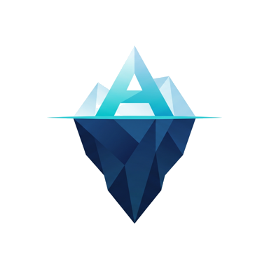

<p align="center">
  
</p>

<h1 align="center">AIceberg</h1>

<p align="center">
  <strong>Le vrai coût de l'automatisation IA, chiffré et sourcé.</strong>
  <br />
  La pointe émergée, c'est le prix de l'API. La masse immergée, c'est le vrai coût.
</p>

<p align="center">
  
  
  
  
  
  
</p>

<p align="center">
  <em>Hackathon · EuraTechnologies, Lille · juin 2026 · thème « Le vrai coût de l'IA »</em>
</p>

<p align="center">
  
</p>

---

## Sommaire

- [Le problème](#le-problème)
- [Ce que fait l'app](#ce-que-fait-lapp)
- [Le cœur défendable : le moteur](#le-cœur-défendable--le-moteur)
- [Stack technique](#stack-technique)
- [Démarrer en local](#démarrer-en-local)
- [Déploiement](#déploiement)
- [Structure](#structure)
- [Méthodologie et sources](#méthodologie-et-sources)

---

## Le problème

Les décideurs comparent un prix d'API à un salaire et passent à côté du reste. Résultat : des automatisations qui finissent par coûter **plus cher qu'un ingénieur**.

AIceberg prend un process métier (par exemple « répondre à 500 emails SAV par mois ») et calcule le coût **complet** d'une automatisation par IA face au coût humain actuel : pas seulement les tokens, mais le temps humain de vérification, le risque d'erreur, les coûts de mise en place, et l'empreinte énergie / eau / carbone. Il assume ses fourchettes d'incertitude plutôt que de sortir un faux chiffre précis.

Il en sort une décision actionnable, avec le seuil de bascule et le modèle optimal :

<p align="center">
  
  
  
</p>

## Ce que fait l'app

| | |
|---|---|
| 🗣️ **Langage naturel** | Décrivez un process en une phrase, Claude Haiku en déduit un scénario chiffré et affiche ses hypothèses. |
| ⚖️ **Verdict chiffré** | Économies (ou surcoût) mensuelles, seuil de bascule, et le déclencheur principal en une phrase. |
| 🧊 **Décomposition du coût** | Tokens API / vérification humaine / risque d'erreur par tâche, plus les coûts fixes amortis. |
| 📈 **Courbe de bascule** | Coût humain contre coût IA selon le volume, avec le seuil de croisement. |
| 🛡️ **Trois voies** | Humain, IA cloud, IA locale souveraine (données chez le client). Le surcoût de la souveraineté est chiffré. |
| 🌱 **Sobriété et empreinte** | Classement des modèles par coût ou par énergie, et empreinte eau / carbone par tâche avec ses fourchettes. |
| 🏢 **Mode portefeuille** | Agrège plusieurs process pour un arbitrage consolidé à l'échelle de l'entreprise. |
| 🎬 **Landing immersive** | Vidéo d'iceberg scrubbée au scroll (GSAP ScrollTrigger + ScrollSmoother), export du verdict en PNG. |

## Le cœur défendable : le moteur

Toute la logique de calcul vit dans `src/lib/engine.ts`, en **fonctions pures, typées et inspectables** : aucune boîte noire, aucun appel réseau. Le LLM ne sert qu'à pré-remplir un scénario, il n'intervient jamais dans le calcul.

Principales sorties : `evaluate`, `rankModels`, `breakEvenCurve`, `rankBySobriety`, `footprintRange`, `evaluatePortfolio`, `compareDeployments`.

### Le modèle de coût

Pour un process de volume `V` tâches par mois :

```
Coût humain / tâche  = (minutes / 60) x coût horaire chargé
                       + taux d'erreur humain x coût d'incident

Coût IA / tâche      = tokens + vérification + risque
   tokens            = (tokens_in / 1e6 x prix_in + tokens_out / 1e6 x prix_out)
   vérification      = taux_de_relecture x (minutes_relecture / 60) x coût horaire
   risque            = taux_d'erreur_résiduel x coût d'incident

Coût mensuel IA      = V x coût_IA_variable + coûts_fixes   (abonnement + setup amorti)

Seuil de bascule     = coûts_fixes / (coût_humain/tâche - coût_IA_variable/tâche)
```

Les trois verdicts découlent du signe des économies et de seuils de décision transparents (taux de vérification, taux d'erreur, marge nette). Le même coût d'incident vaut pour l'humain et l'IA : un incident coûte pareil quelle que soit sa source.

## Stack technique

- **TanStack Start** (React 19 + Vite, SSR) avec server functions
- **Tailwind CSS v4**
- **recharts** (graphes), **lucide-react** (icônes)
- **GSAP** (ScrollTrigger + ScrollSmoother) pour la landing scrollée
- **@anthropic-ai/sdk** + **zod** pour l'estimation en langage naturel (Claude Haiku)
- Déploiement **Vercel** via le preset Nitro

## Démarrer en local

Prérequis : **Node 22+**.

```bash
npm install
```

Le langage naturel appelle l'API Anthropic, il faut donc une clé. Elle reste **uniquement côté serveur** (server function), elle ne part jamais au navigateur. En dev, passez-la en variable d'environnement au lancement (le `.env` n'est pas toujours injecté dans `process.env` par Vite) :

```bash
export ANTHROPIC_API_KEY=sk-ant-votre-cle
npm run dev
```

L'app démarre sur `http://localhost:8080/`.

> **Astuce** : les exemples préremplis, la saisie manuelle et tout le moteur fonctionnent **sans clé**. Seul le champ de description en langage naturel a besoin de l'API.

### Scripts

| Commande | Effet |
|---|---|
| `npm run dev` | Serveur de développement (port 8080) |
| `npm run build` | Build de production (sortie `.vercel/output`) |
| `npm run preview` | Prévisualise le build |
| `npm run lint` | ESLint |
| `npm run format` | Prettier |

## Déploiement

Sur **Vercel** :

1. Importer le repo sur vercel.com.
2. Laisser le framework auto-détecté, build command `npm run build` (Nitro génère `.vercel/output`, servi automatiquement).
3. Ajouter la variable d'environnement `ANTHROPIC_API_KEY` (Production + Preview + Development).
4. Déployer. Chaque push redéploie.

## Structure

```
src/
  lib/
    engine.ts                  # le moteur de calcul (source de vérité, fonctions pures)
    api/estimate.functions.ts  # server function : langage naturel -> scénario (Claude Haiku)
  routes/
    __root.tsx                 # head, shell, méta, favicon
    index.tsx                  # landing scrollée + écran de résultats (3 niveaux)
public/
  dive-full.mp4                # vidéo d'iceberg (surface + plongée) scrubbée au scroll
  hero-poster.jpg              # poster / fallback
  logo-aiceberg.png            # logo + favicon
```

## Méthodologie et sources

Le brief demande « du chiffre sourcé, pas de l'effet de démo ». Chaque nombre affiché vient d'une source datée, avec sa fourchette d'incertitude.

| Donnée | Source | Note |
|---|---|---|
| **Tarifs API** | Grilles officielles (Anthropic, OpenAI, Google, Mistral) | Converties en EUR (1 USD = 0,92 EUR). À revalider, les prix bougent. |
| **Énergie** | arXiv:2505.09598 « How Hungry is AI? » (mai 2025) | Classée par familles de modèles. |
| **Eau** | arXiv:2304.03271 | On-site ~1,7 mL/Wh, cycle de vie ~45 mL/Wh. On affiche la fourchette. |
| **Carbone** | RTE eco2mix / Ember 2024 | France 56 · UE 250 · USA 369 · Monde 480 gCO2eq/kWh. |

---

<p align="center">
  <strong>Le message de fond :</strong> le vrai levier de décision n'est presque jamais le prix au token (dérisoire),
  <br />
  c'est le <strong>coût humain de vérification</strong> et le <strong>risque d'erreur</strong>. C'est ce qu'AIceberg rend visible.
</p>
